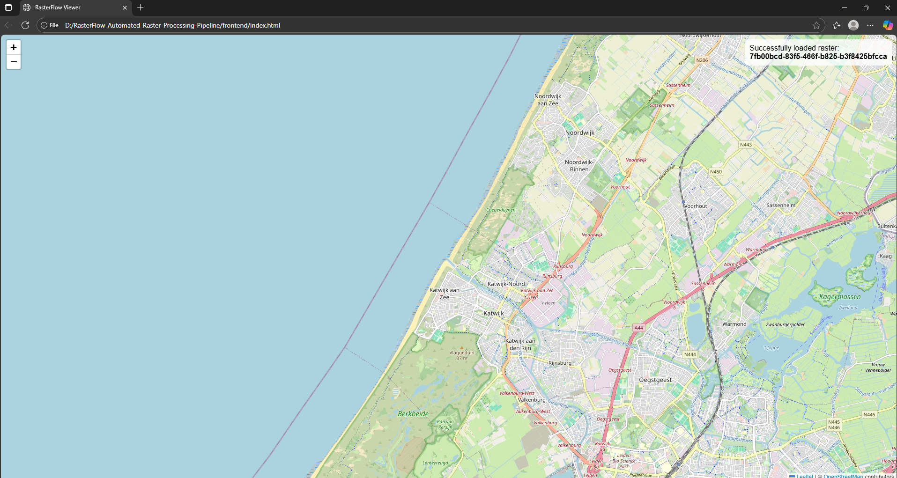

# RasterFlow: A Lightweight Raster Processing Pipeline


RasterFlow is a lightweight yet powerful raster processing pipeline designed as an MVP to demonstrate efficient, scalable raster data workflows. It showcases the core components of modern GIS product engineering by combining a robust backend API with industry-standard geospatial processing libraries.

The system ingests raster datasets (e.g., GeoTIFFs), validates them, and processes them through an automated pipeline: **Reproject → Tile → Serve**. The result is a set of web-ready map tiles and metadata accessible through a simple REST API, which can be visualized with the included frontend viewer.

---

## 🎥 Live Demo


---

## ✨ Key Features

- **RESTful API:** Upload and manage raster data via a clean FastAPI interface.  
- **Automated Reprojection:** Automatically reprojects all incoming rasters to the web standard CRS (WGS84 / EPSG:4326).  
- **On-the-Fly Tiling:** Generates a full XYZ map tile cache for efficient visualization.  
- **Input Validation:** Rejects invalid or corrupted files at the endpoint to protect the pipeline.  
- **Batch Processing:** Upload and process multiple rasters in a single API call.  
- **Interactive Map Viewer:** A simple Leaflet.js frontend to visualize the processed tile outputs.  
- **Containerized Environment:** Fully containerized with Docker for easy, reproducible deployment.  

---

## 🛠️ Technology Stack

- **Backend:** FastAPI, Uvicorn  
- **Geospatial Processing:** GDAL, Rasterio  
- **Containerization:** Docker  
- **Frontend Viewer:** Leaflet.js, HTML, CSS  

---

## 🚀 Getting Started

Follow these instructions to get RasterFlow running on your local machine.

### Prerequisites

- [Git](https://git-scm.com/)  
- [Docker Desktop](https://www.docker.com/products/docker-desktop/)  

### Installation & Setup

1. **Clone the repository:**
   ```bash
   git clone https://github.com/your-username/RasterFlow-Automated-Raster-Processing-Pipeline.git
   cd RasterFlow-Automated-Raster-Processing-Pipeline ```

2. **Build the Docker image:**

This will build the environment from the `Dockerfile`, installing Ubuntu, GDAL, and all Python dependencies.
```bash
docker build -t rasterflow .
```

3. **Run the Docker container:**

This command starts the application and maps the `data` directory to your local machine, so processed files are persisted.

For Windows PowerShell:
```bash
docker run -d -p 8000:8000 -v "$(pwd)/data:/app/data" --name rasterflow-container rasterflow
```

For Windows Command Prompt (cmd.exe):
```bash
docker run -d -p 8000:8000 -v "%cd%/data:/app/data" --name rasterflow-container rasterflow
```

4. **Verify the server is running:**
```bash
docker ps
```

You should see `rasterflow-container` in the list of running containers.


## 📖 API Usage

Interact with the running service using a client like curl.

1. **Upload a Single Raster**

Place a sample GeoTIFF (e.g., sample.tif) in the data/raw directory.

```bash 
curl -X POST -F "file=@data/raw/sample.tif" http://localhost:8000/v1/rasters 
```

```bash 
Response:
{
  "raster_id": "...",
  "status": "processing",
  "message": "Upload accepted and validated."
}
```

2. **Upload a Batch of Rasters**

Place multiple rasters in the data/raw directory (e.g., sample.tif, sample2.tif).
```bash 
curl -X POST -F "file=@data/raw/sample.tif" -F "file=@data/raw/sample2.tif" http://localhost:8000/v1/rasters/batch
```

```bash 
Response:
{
  "successful_jobs": [...],
  "failed_jobs": [...]
}
```

3. **Check Job Status**

Use the raster_id from the upload response.
```bash 
curl http://localhost:8000/v1/rasters/<YOUR_RASTER_ID>/status
```

```bash 
Response:

{
  "raster_id": "<YOUR_RASTER_ID>",
  "status": "complete"
}
```

4. **Get Raster Metadata**

Once a job is complete, you can retrieve its metadata.

curl http://localhost:8000/v1/rasters/<YOUR_RASTER_ID>/metadata

## 🗺️ Using the Frontend Viewer

After a raster has been successfully processed, get its raster_id.

Open the frontend/index.html file in your web browser.

When prompted, paste the raster_id and click OK.

The map will load and automatically zoom to your processed raster layer.

## 🔮 Future Roadmap

Vector Overlays: Burn GeoJSON features onto processed rasters.

Persistent Job Store: Replace the in-memory cache with Redis or a database for production resilience.

Cloud Integration: Watch an S3 bucket for new files to trigger ingestion automatically.

Authentication: Add a simple API key layer for security.

Integration with a Feature Store: Push raster metadata and statistics to a feature store for ML applications.

## 📜 License

This project is licensed under the MIT License. See the LICENSE file for details.